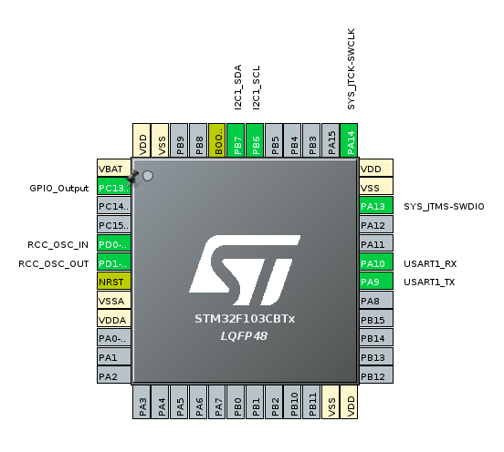
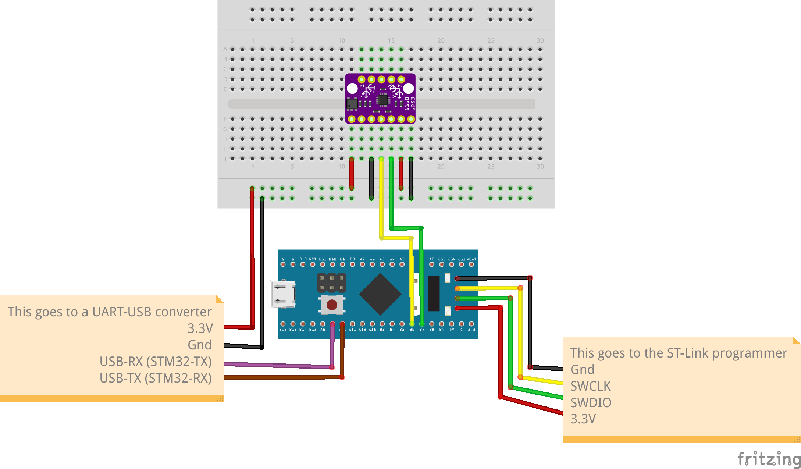
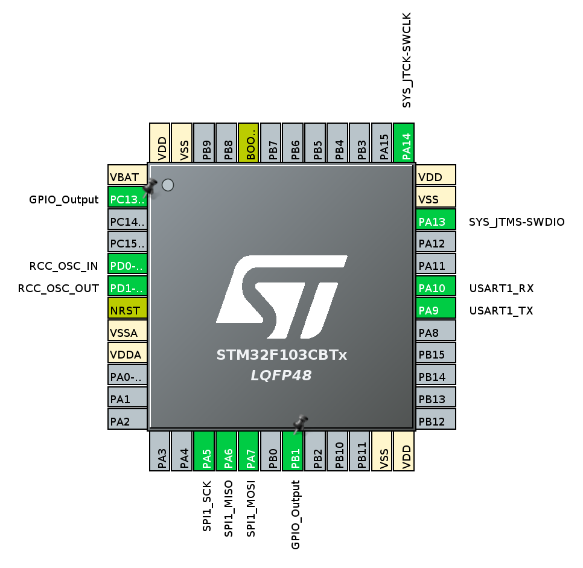
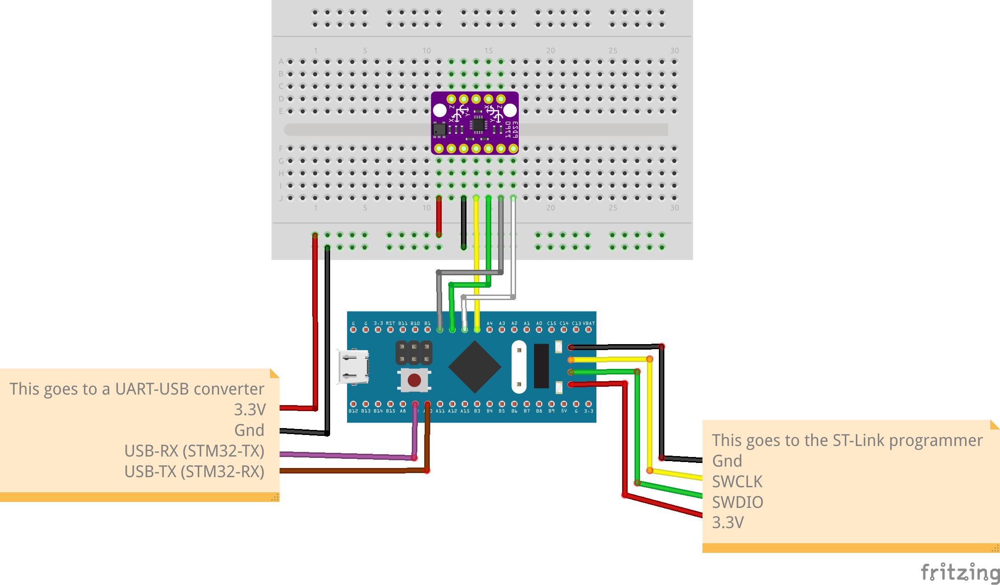

# BMI160 example projects

For these projects the [STM32 Cube IDE](https://www.st.com/en/development-tools/stm32cubeide.html) was used as it is the official IDE provided by ST, other options are 

## Reading data through I2C

### Connection table

| BMI160 pin | BMI160 funcion | STM32 pin | STM32 pin function |
|------------|----------------|-----------|--------------------|
| 6          | VIN            | 3V3       | 3V3                |
| 8          | GND            | GND       | GND                |
| 9          | SCL            | A5        | SCL                |
| 10         | SDA            | A4        | SDA                |
| 11         | CS             | 3V3       | 3V3                |
| 12         | SA0            | GND       | GND                |

[#] SA0 pin is set to GND to select address 0x68

### Diagrams

#### STM32CubeIDE Pinout view

#### Fritzing diagram

## Reading data through SPI

### Connection table

| BMI160 pin | BMI160 pin funcion | STM32 pin | STM32 pin function |
|------------|--------------------|-----------|--------------------|
| 6          | VIN                | 3V3       | 3V3                |
| 8          | GND                | GND       | GND                |
| 9          | SCL                | A5        | SCK                |
| 10         | SDA                | A6        | MOSI               |
| 11         | CS                 | B0        | GPIO B0            |
| 12         | SA0                | A7        | MISO               |

### Diagrams

#### STM32CubeIDE Pinout view

#### Fritzing diagram

