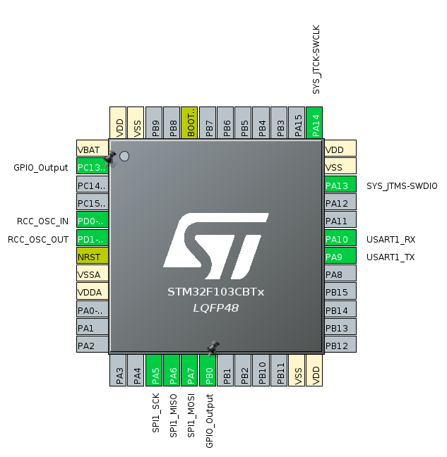

# GY-91 example projects

For these projects the [STM32 Cube IDE](https://www.st.com/en/development-tools/stm32cubeide.html) was used as it is the official IDE provided by ST, other options are 

## Reading data through I2C

Not implemented

## Reading data through SPI

### Connection table

| GY-91 pin | GY-91 pin funcion | STM32 pin | STM32 pin function |
|-----------|-------------------|-----------|--------------------|
| 1         | VIN               | 3V3       | 3V3                |
| 3         | GND               | GND       | GND                |
| 4         | SCL               | A5        | SCK                |
| 5         | SDA               | A6        | MOSI               |
| 6         | SDO/SA0           | A7        | MISO               |
| 7         | NCS               | B0        | GPIO B0            |

### Diagrams

#### STM32CubeIDE Pinout view

#### Fritzing diagram

Not available

